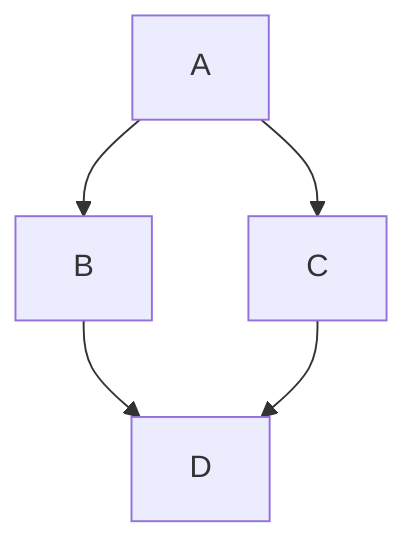

# Heading 1

# Heading 1

# Heading 1

:::ExpandableHeading
# Expandable Heading 1

Expandable Heading 1 Content
:::

## Heading 2

## Heading 2

## Heading 2

:::ExpandableHeading
## Expandable Heading 2

Expandable Heading 2 Content
:::

### Heading 3

### Heading 3

### Heading 3

:::ExpandableHeading
### Expandable Heading 3

Expandable Heading 3 Content
:::

- [ ] Checklist
- [ ] Checklist 2
- [ ] Checklist 3

<table isTableHeaderOn="true" columnWidths="220,220,221">
  <tr>
    <td align="left">
      <p>TABLE</p>
    </td>
    <td align="left">
      <p>TABLE</p>
    </td>
    <td align="left">
      <p>TABLE</p>
    </td>
  </tr>
  <tr>
    <td align="left">
      <p>TABLE</p>
    </td>
    <td align="left">
      <p>TABLE</p>
    </td>
    <td align="left">
      <p>TABLE</p>
    </td>
  </tr>
  <tr>
    <td align="left">
      <p>TABLE</p>
    </td>
    <td align="left">
      <p>TABLE</p>
    </td>
    <td align="left">
      <p>TABLE</p>
    </td>
  </tr>
  <tr>
    <td align="left">
      <p>TABLE</p>
    </td>
    <td align="left">
      <p>TABLE</p>
    </td>
    <td align="left">
      <p>TABLE</p>
    </td>
  </tr>
</table>

:::CtaButton{label="BUTTON" openInNewTab="true" noFollow="false"}

:::

:::hint{type="info"}
Callout
:::

***

::::VerticalSplit{layout="middle"}
:::VerticalSplitItem
VERTICAL SPLIT, LEFT SIDE
:::

:::VerticalSplitItem
VERTICAL SPLIT, RIGHT SIDE
:::
::::

:::DropList
```json
{
  "columns": [
    {
      "id": "1",
      "name": "Doing ",
      "items": [
        {
          "id": "rHDDyNM3sH2y91Ksto0e-",
          "content": "MINI TASK 1",
          "justAdded": false
        }
      ]
    },
    {
      "id": "2",
      "name": "Testing",
      "items": [
        {
          "id": "JfAw50UQzlx4xnXuNXcz6",
          "content": "MINI TASK 2",
          "justAdded": false
        }
      ]
    },
    {
      "id": "3",
      "name": "Done",
      "items": [
        {
          "id": "vCAFu03O_YEM2zPZoWvGV",
          "content": "MINI TASK 3",
          "justAdded": false
        }
      ]
    }
  ]
}
```
:::

::::LinkArray
:::LinkArrayItem{headerType="COLOR" headerColor="#4338CA"}
LINK GRID 1
:::

:::LinkArrayItem{headerType="COLOR" headerColor="#CA8A04"}
LINK GRID 2
:::

:::LinkArrayItem{headerType="COLOR" headerColor="#6366F1"}
LINK GRID 3
:::
::::

::::WorkflowBlock
:::WorkflowBlockItem
Workflow 1

Content of workflow 1
:::

:::WorkflowBlockItem
Workflow 2

Content of workflow 2
:::
::::

::::Tabs
:::Tab{title="TAB 1"}
Content of Tab 1
:::

:::Tab{title="TAB 2"}
Content of Tab 2
:::

:::Tab{title="New Tab"}

:::

:::Tab{title="New Tab"}

:::
::::

- Bullet list 1
  - Bullet list 2
    - Bullet list 3

1. Numbered list 1
   1. Numbered list 2
      1. Numbered list 3

:::Map
```json
{
  "center": [
    -65.36683689226321,
    -71.71875000000001
  ],
  "zoom": 0,
  "markerPositions": []
}
```
:::

```javascript
```



```tex
int_0^infty x^2 dx
```

:::ApiMethodV2
```json
{
  "name": "Get Cakes",
  "method": "GET",
  "url": "https://api.cakes.com",
  "description": "Get a cake by its ID",
  "tab": "examples",
  "examples": {
    "languages": [
      {
        "id": "K97Ze11xRbVLlgHVWxjXd",
        "language": "javascript",
        "code": "var myHeaders = new Headers();\nmyHeaders.append(\"Accept\", \"application/json\");\nmyHeaders.append(\"Content-Type\", \"application/json\");\n\nvar raw = JSON.stringify({\n   \"id\": \"String\"\n});\n\nvar requestOptions = {\n   method: 'GET',\n   headers: myHeaders,\n   body: raw,\n   redirect: 'follow'\n};\n\nfetch(\"https://api.cakes.com\", requestOptions)\n   .then(response => response.text())\n   .then(result => console.log(result))\n   .catch(error => console.log('error', error));",
        "customLabel": ""
      }
    ],
    "selectedLanguageId": "K97Ze11xRbVLlgHVWxjXd"
  },
  "results": {
    "languages": [
      {
        "id": "NwLVyfw4ARuO3yV0j6Ms6",
        "language": "200",
        "code": "{\n  \"name\": \"Cake's name\",\n}",
        "customLabel": ""
      },
      {
        "id": "E1gBuupwbkH41WX5p0TmP",
        "language": "404",
        "code": "{\n  \"message\": \"Ain't no cake like that.\"\n}",
        "customLabel": ""
      }
    ],
    "selectedLanguageId": "NwLVyfw4ARuO3yV0j6Ms6"
  },
  "request": {
    "pathParameters": [],
    "queryParameters": [],
    "headerParameters": [],
    "formDataParameters": [],
    "bodyDataParameters": [
      {
        "name": "id",
        "kind": "required",
        "type": "string",
        "description": "ID of the cake to get"
      }
    ]
  },
  "currentNewParameter": {
    "label": "Body Parameter",
    "value": "bodyDataParameters"
  },
  "hasTryItOut": false,
  "customAnchorSlug": "get-cakes"
}
```
:::

:::Swagger
```json
{
  "jsonFileLocation": "https://petstore.swagger.io/v2/swagger.json",
  "headers": []
}
```
:::

:::GraphiQL
```json
{
  "endpoint": "https://app.archbee.com/api/graphql",
  "query": "{\n  status,\n  people\n}"
}
```
:::

:::Changelog{title="Changelog Title"}
::ChangelogItem{type="added" description="Content 1"}

::ChangelogItem{type="fixed" description="Content 2"}
:::

:::Iframe{code="<!-- <p>paste iframe code here</p> -->"}

:::
