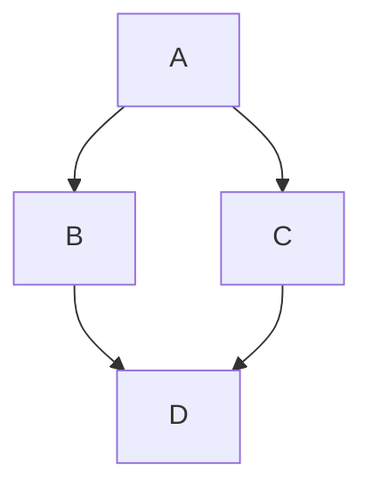

# Heading 1

# Heading 1

# Heading 1

<ExpandableHeading>
  # Expandable Heading 1

  Expandable Heading 1 Content
</ExpandableHeading>

## Heading 2

## Heading 2

## Heading 2

<ExpandableHeading>
  ## Expandable Heading 2

  Expandable Heading 2 Content
</ExpandableHeading>

### Heading 3

### Heading 3

### Heading 3

<ExpandableHeading>
  ### Expandable Heading 3

  Expandable Heading 3 Content
</ExpandableHeading>

- [ ] Checklist
- [ ] Checklist 2
- [ ] Checklist 3

<table isTableHeaderOn="true" columnWidths="220,220,221">
  <tr>
    <td align="left">
      TABLE
    </td>
    <td align="left">
      TABLE
    </td>
    <td align="left">
      TABLE
    </td>
  </tr>
  <tr>
    <td align="left">
      TABLE
    </td>
    <td align="left">
      TABLE
    </td>
    <td align="left">
      TABLE
    </td>
  </tr>
  <tr>
    <td align="left">
      TABLE
    </td>
    <td align="left">
      TABLE
    </td>
    <td align="left">
      TABLE
    </td>
  </tr>
  <tr>
    <td align="left">
      TABLE
    </td>
    <td align="left">
      TABLE
    </td>
    <td align="left">
      TABLE
    </td>
  </tr>
</table>

<CtaButton label="BUTTON" openInNewTab="true" noFollow="false">

</CtaButton>

<hint type="info">
  Callout
</hint>

***

<VerticalSplit layout="middle">
  <VerticalSplitItem>
    VERTICAL SPLIT, LEFT SIDE
  </VerticalSplitItem>

  <VerticalSplitItem>
    VERTICAL SPLIT, RIGHT SIDE
  </VerticalSplitItem>
</VerticalSplit>

<DropList data="{&#x22;columns&#x22;:[{&#x22;id&#x22;:&#x22;1&#x22;,&#x22;name&#x22;:&#x22;Doing &#x22;,&#x22;items&#x22;:[{&#x22;id&#x22;:&#x22;rHDDyNM3sH2y91Ksto0e-&#x22;,&#x22;content&#x22;:&#x22;MINI TASK 1&#x22;,&#x22;justAdded&#x22;:false}]},{&#x22;id&#x22;:&#x22;2&#x22;,&#x22;name&#x22;:&#x22;Testing&#x22;,&#x22;items&#x22;:[{&#x22;id&#x22;:&#x22;JfAw50UQzlx4xnXuNXcz6&#x22;,&#x22;content&#x22;:&#x22;MINI TASK 2&#x22;,&#x22;justAdded&#x22;:false}]},{&#x22;id&#x22;:&#x22;3&#x22;,&#x22;name&#x22;:&#x22;Done&#x22;,&#x22;items&#x22;:[{&#x22;id&#x22;:&#x22;vCAFu03O_YEM2zPZoWvGV&#x22;,&#x22;content&#x22;:&#x22;MINI TASK 3&#x22;,&#x22;justAdded&#x22;:false}]}]}">
  ```json
  {
    "columns": [
      {
        "id": "1",
        "name": "Doing ",
        "items": [
          {
            "id": "rHDDyNM3sH2y91Ksto0e-",
            "content": "MINI TASK 1",
            "justAdded": false
          }
        ]
      },
      {
        "id": "2",
        "name": "Testing",
        "items": [
          {
            "id": "JfAw50UQzlx4xnXuNXcz6",
            "content": "MINI TASK 2",
            "justAdded": false
          }
        ]
      },
      {
        "id": "3",
        "name": "Done",
        "items": [
          {
            "id": "vCAFu03O_YEM2zPZoWvGV",
            "content": "MINI TASK 3",
            "justAdded": false
          }
        ]
      }
    ]
  }
  ```
</DropList>

<LinkArray>
  <LinkArrayItem headerType="COLOR" headerColor="#4338CA">
    LINK GRID 1
  </LinkArrayItem>

  <LinkArrayItem headerType="COLOR" headerColor="#CA8A04">
    LINK GRID 2
  </LinkArrayItem>

  <LinkArrayItem headerType="COLOR" headerColor="#6366F1">
    LINK GRID 3
  </LinkArrayItem>
</LinkArray>

<WorkflowBlock>
  <WorkflowBlockItem>
    Workflow 1

    Content of workflow 1
  </WorkflowBlockItem>

  <WorkflowBlockItem>
    Workflow 2

    Content of workflow 2
  </WorkflowBlockItem>
</WorkflowBlock>

<Tabs>
  <Tab title="TAB 1">
    Content of Tab 1
  </Tab>

  <Tab title="TAB 2">
    Content of Tab 2
  </Tab>

  <Tab title="New Tab">

  </Tab>

  <Tab title="New Tab">

  </Tab>
</Tabs>

- Bullet list 1
  - Bullet list 2
    - Bullet list 3

1. Numbered list 1
   1. Numbered list 2
      1. Numbered list 3

<Map data="{&#x22;center&#x22;:[-65.36683689226321,-71.71875000000001],&#x22;zoom&#x22;:0,&#x22;markerPositions&#x22;:[]}">
  ```json
  {
    "center": [
      -65.36683689226321,
      -71.71875000000001
    ],
    "zoom": 0,
    "markerPositions": []
  }
  ```
</Map>

```javascript
```



```tex
int_0^infty x^2 dx
```

<ApiMethodV2 data="{&#x22;name&#x22;:&#x22;Get Cakes&#x22;,&#x22;method&#x22;:&#x22;GET&#x22;,&#x22;url&#x22;:&#x22;https://api.cakes.com&#x22;,&#x22;description&#x22;:&#x22;Get a cake by its ID&#x22;,&#x22;tab&#x22;:&#x22;examples&#x22;,&#x22;examples&#x22;:{&#x22;languages&#x22;:[{&#x22;id&#x22;:&#x22;K97Ze11xRbVLlgHVWxjXd&#x22;,&#x22;language&#x22;:&#x22;javascript&#x22;,&#x22;code&#x22;:&#x22;var myHeaders = new Headers();\nmyHeaders.append(\&#x22;Accept\&#x22;, \&#x22;application/json\&#x22;);\nmyHeaders.append(\&#x22;Content-Type\&#x22;, \&#x22;application/json\&#x22;);\n\nvar raw = JSON.stringify({\n   \&#x22;id\&#x22;: \&#x22;String\&#x22;\n});\n\nvar requestOptions = {\n   method: 'GET',\n   headers: myHeaders,\n   body: raw,\n   redirect: 'follow'\n};\n\nfetch(\&#x22;https://api.cakes.com\&#x22;, requestOptions)\n   .then(response => response.text())\n   .then(result => console.log(result))\n   .catch(error => console.log('error', error));&#x22;,&#x22;customLabel&#x22;:&#x22;&#x22;}],&#x22;selectedLanguageId&#x22;:&#x22;K97Ze11xRbVLlgHVWxjXd&#x22;},&#x22;results&#x22;:{&#x22;languages&#x22;:[{&#x22;id&#x22;:&#x22;NwLVyfw4ARuO3yV0j6Ms6&#x22;,&#x22;language&#x22;:&#x22;200&#x22;,&#x22;code&#x22;:&#x22;{\n  \&#x22;name\&#x22;: \&#x22;Cake's name\&#x22;,\n}&#x22;,&#x22;customLabel&#x22;:&#x22;&#x22;},{&#x22;id&#x22;:&#x22;E1gBuupwbkH41WX5p0TmP&#x22;,&#x22;language&#x22;:&#x22;404&#x22;,&#x22;code&#x22;:&#x22;{\n  \&#x22;message\&#x22;: \&#x22;Ain't no cake like that.\&#x22;\n}&#x22;,&#x22;customLabel&#x22;:&#x22;&#x22;}],&#x22;selectedLanguageId&#x22;:&#x22;NwLVyfw4ARuO3yV0j6Ms6&#x22;},&#x22;request&#x22;:{&#x22;pathParameters&#x22;:[],&#x22;queryParameters&#x22;:[],&#x22;headerParameters&#x22;:[],&#x22;formDataParameters&#x22;:[],&#x22;bodyDataParameters&#x22;:[{&#x22;name&#x22;:&#x22;id&#x22;,&#x22;kind&#x22;:&#x22;required&#x22;,&#x22;type&#x22;:&#x22;string&#x22;,&#x22;description&#x22;:&#x22;ID of the cake to get&#x22;}]},&#x22;currentNewParameter&#x22;:{&#x22;label&#x22;:&#x22;Body Parameter&#x22;,&#x22;value&#x22;:&#x22;bodyDataParameters&#x22;},&#x22;hasTryItOut&#x22;:false,&#x22;customAnchorSlug&#x22;:&#x22;get-cakes&#x22;}">

</ApiMethodV2>

<Swagger data="{&#x22;jsonFileLocation&#x22;:&#x22;https://petstore.swagger.io/v2/swagger.json&#x22;,&#x22;headers&#x22;:[]}">
  ```json
  {
    "jsonFileLocation": "https://petstore.swagger.io/v2/swagger.json",
    "headers": []
  }
  ```
</Swagger>

<GraphiQL data="{&#x22;endpoint&#x22;:&#x22;https://app.archbee.com/api/graphql&#x22;,&#x22;query&#x22;:&#x22;{\n  status,\n  people\n}&#x22;}">
  ```json
  {
    "endpoint": "https://app.archbee.com/api/graphql",
    "query": "{\n  status,\n  people\n}"
  }
  ```
</GraphiQL>

<Changelog title="Changelog Title">
  <ChangelogItem type="added" description="Content 1" />

  <ChangelogItem type="fixed" description="Content 2" />
</Changelog>

<Iframe code="<!-- <p>paste iframe code here</p> -->">

</Iframe>
